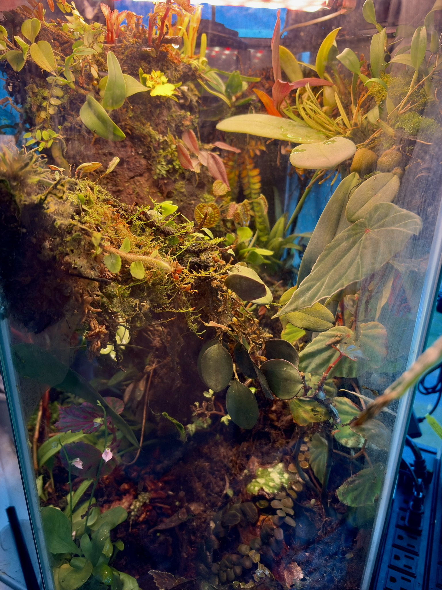
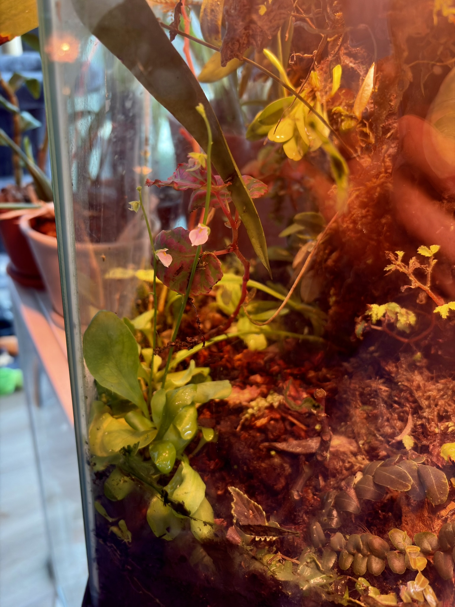
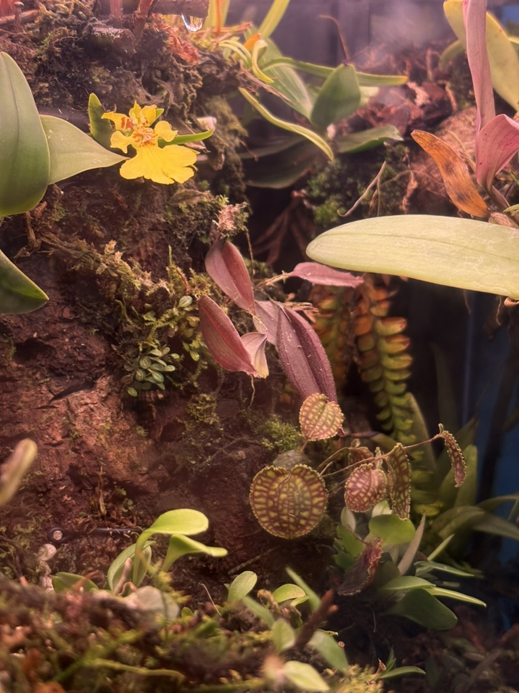
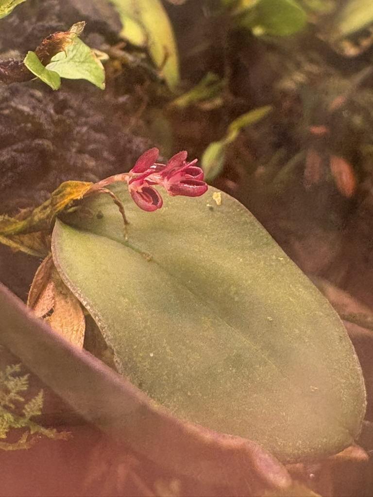

# Build

  

Here are a few recent photos from the hexagonal terrarium after several more plants settled in and started blooming.

  

  
  
  

I've sourced a lot of components from various sites for this build.

- Here's a [public Amazon list](https://www.amazon.com/hz/wishlist/ls/1ARZ5WK7A2QLO?ref_=wl_share) with most of the hardware I used to get this orchidarium off the ground.
- I sourced the large cork bark log [from a seller on Etsy](https://www.etsy.com/listing/1855324948/oversize-cork-rounds-cut-to-length?ref=yr_purchases) who specializes in terrariums.
- Many of the orchids that have been mounted in the terrarium are from ecuagenera, as well as a number of other retail sellers and auctions. Begonias and other terrestrial plants have been sourced from various sellers on Etsy, including [Botanicaz](https://www.etsy.com/shop/Botanicaz?ref=yr_purchases) and [FloraEpiphytica](https://www.etsy.com/shop/FloraEpiphytica?ref=yr_purchases).

## Sensors

Current supported sensors by this Python package include a

- [Humidity and Temperature sensor](https://www.amazon.com/dp/B08BYLZ3ML?ref=ppx_yo2ov_dt_b_fed_asin_title): a waterproof temperature and humidity sensor.
- [Soil metrics](https://www.amazon.com/dp/B0FJFK9PPT?ref=ppx_yo2ov_dt_b_fed_asin_title): a sensor for collecting soil analytics.

## Previous Builds

  
<b>Show</b>

  This is the second terrarium I've built, following the first (pictured below).

  

    
  

